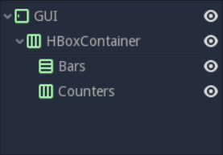
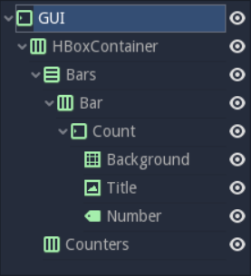
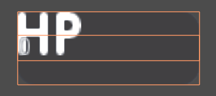
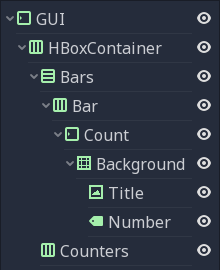
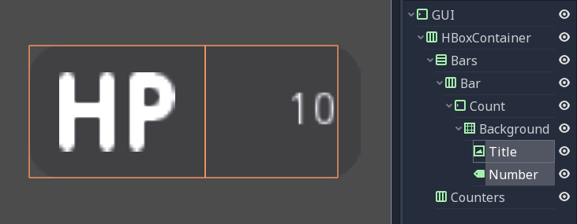
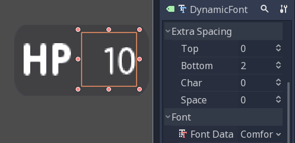
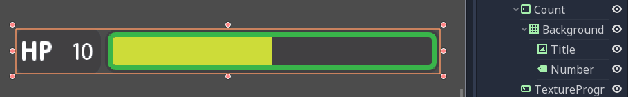
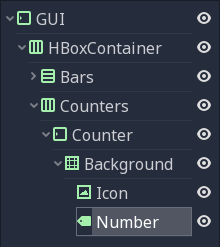
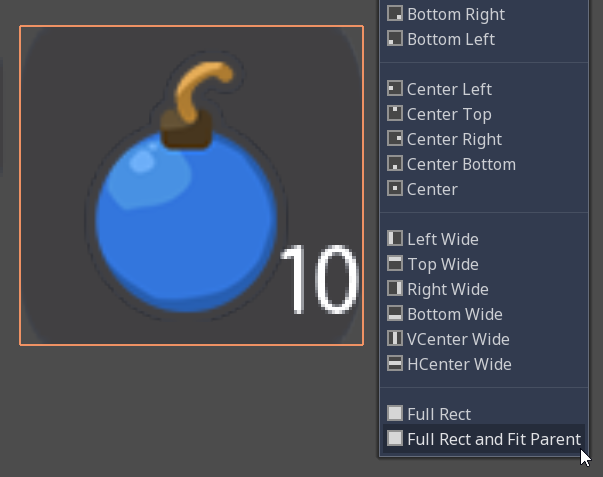
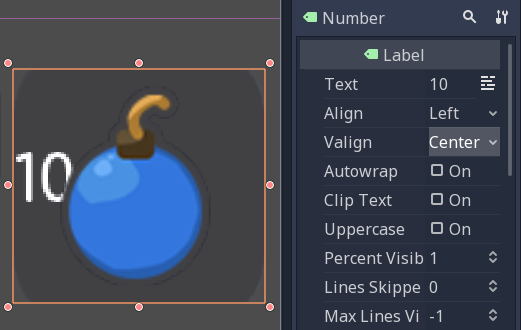

# Design the GUI

Now that you've nailed the basics, we're going to see how to build a Game User Interface (GUI) with reusable UI components: a life bar, an energy bar, and bomb and rupee counters. By the end of this tutorial, you'll have a game GUI, ready to control with GDscript or VisualScript:

You'll also learn to:

1. Create flexible UI components
1. Use scene inheritance
1. Build a complex UI

## Breaking down the UI

Let's break down the final UI and plan the containers we'll use. As in the [main menu tutorial](#), it starts with a `MarginContainer`. Then, we can see up to three columns:

1. The life and energy counters on the left
2. The life and energy bars
3. The bomb and rupee counters on the right

But the bar's label and the gauge are two parts of the same UI element. If we think of them this way, we're left with two columns:

1. The life and energy bars on the left
1. The bomb and rupee counters on the right

This makes it easier to nest containers: we have some margins around the border of the screen using a `MarginContainer`, followed by an `HBoxContainer` to manage our two columns. The two bars stack on top of one another inside a `VBoxContainer`. And we'll need a last `HBoxContainer` in the right column to place the bomb and rupee counters side-by-side.

We will need extra containers inside the individual UI components, but this gives us the main GUI scene's structure. With this plan in place, we can jump into Godot and create our GUI.

## Create the base GUI

There 2 possible approaches to the GUI: we can design elements in separate scenes and put them together, or prototype everything in a single scene and break it down later. I recommend working with a single scene as you can play with your UI's placement and proportions faster this way. Once it looks good, you can save entire sections of the node tree as reusable sub-scenes. We'll do just that in a moment.

For now, let's start with a few containers.

Create a new scene and add a `MarginContainer`. Select the node and name it `GUI`. Then save the scene and name it `GUI.tscn`. It will contain the entire GUI.

With the `MarginContainer` selected, head to the inspector and scroll down to the custom constants section. Unfold it and click the field next to each of the `Margin` properties. Set them all to `20` pixels. Next, add an `HBoxContainer` node. This one will contain our two bars on the left and separate them from the two counters on the right. 

We want to stack the bars vertically inside the `HBoxContainer`. To do this, let's add a `VBoxContainer`. Name it `Bars`. Select the parent `HBoxContainer` again and this time, add another `HBoxContainer`. This one will hold the counters, so call it `Counters`. With these four containers, we have the base for our GUI scene.

.. note:: We can work this way because we first broke down our UI design and took a few moments to think about the containers we'd use. When you follow a tutorial like this, it may seem weird. But once you're working on real games, you'll see it's an efficient workflow.

### Create the bars' base

Each bar is split into two sub-elements that align horizontally: the label with the health count on the left, and the gauge on the right. Once again, the `HBoxContainer` is the perfect tool for the job. Select the `Bars` node and add a new `HBoxContainer` inside of it. Name it `Bar`.

The label itself is requires at least three nodes: a `NinePatchRect` for the background, on top of which we'll add a sprite on the left, either `HP` or `EP`, and a `Label` on the right for the value. We can nest `Control` nodes however we want. We could use the `NinePatchRect` as a parent for the two other elements, as it encompasses them. In general, you want to use containers instead, as their role is to help organize UI components. We'll need a `MarginContainer` later anyway to add some space between the life count and the gauge. Select the `Bar` and add a `MarginContainer`. Name it `Count`. Inside of it, add three nodes:

1. A `NinePatchRect` named `Background`
1. A `TextureRect` named `Title`
1. And a `Label` named `Number`

To add the nodes as siblings, always select the `Count` node first.

Our scene is still empty. It's time to throw in some textures. To load the textures, head to the FileSystem dock to the left of the viewport. Browse down to the res://assets/GUI folder.

Select the `Background` in the Scene dock. In the Inspector, you should see a `Texture` property. In the FileSystem tab, click and drag `label_HP_bg.png` onto the `Texture` slot. It stays squashed. The parent MarginContainer will force its size down to 0 until we force elements inside the container to have a minimum size. Select the `Background` node. In the Inspector, scroll down to the Rect section. Set `Min Size` to (100, 40). You should see the `Background` resize along with its parent containers.

Next, select the `Title` and drag and drop `label_HP.png` into its `Texture` slot. Select the `Number` node, click the field next to the `Text` property and type `10`. This way, we can see both nodes in the viewport. They should stack up in the top-left corner of their parent `MarginContainer`.

As they have a container as their direct parent, we cannot move them freely: the `Count` node will always reset their anchors, their size and position. Try to move and resize the nodes in the viewport. Then, select any of the three textures and press Ctrl Up or Ctrl Down to reorder them in the Scene dock. They'll snap back to their previous size and position.

Parent containers control the size, the scale, the margins, and the anchors of their direct children. To modify the nodes, you must nest them inside a regular Control or another UI element. We'll use the `Background` as a parent for the `Title` and `Number`. Select both the `Title` and `Number`, and drag and drop them onto `Background`.

Select the `Title` and in the Inspector, change its `Stretch Mode` property to `Keep Centered`. Resize it in the viewport with the `Select Mode` tool so it only takes the left half of the background. Next, select the `Number` node. In the viewport, click the `Anchor` menu and click `Full Rect and Fit Parent`. The node will resize to fit the `Background`. Head to the Inspector and change its `Align` property to `Right`, and the `VAlign` property to `Center`. The text should snap to the center of the `Background`'s right edge. Resize the node horizontally so it takes the right half of the `Background` and there's a bit of padding with the right edge.

### Replace the Label's font

The label's font is too small. We need to replace it. Select the `Number` node and in the Inspector, scroll down to the `Control` class, and find the `Custom Font` category. Click the field next to the `Font` property and click on `New Dynamic Font`. Click on the field again and select Edit. 

You will enter the `Dynamic Font` resource. Unfold the `Font` category and click the field next to `Font Data`. Click the `Load` button. In the file browser, navigate down to the assets/font folder and double click `Comfortaa-Bold.ttf` to open it. You should see the font update in the viewport. Unfold the settings category to change the font size. Set the `Size` property to a higher value, like `24` or `28`. 

We now need the text's baseline, the number's lower edge, to align with the HP texture on the left. To do so, still in the `DynamicFont` resource, you can tweak the `Bottom` property under the `Extra Spacing` category. It adds some bottom padding to the text. Click the `Number` node in the Scene tab to go back to the node's properties and change the `VAlign` to `Bottom`. To adjust the text's baseline, click on the font field under the `Custom Font` category again and tweak the `Bottom` property until the text aligns with the `Title` node. I used a value of `2` pixels.

With this, we just finished the hardest part of the GUI. Congratulations! Let's move on to the simpler nodes.

### Add the progress bar

We need one last element to complete our life bar: the gauge itself. Godot ships with a `TextureProgress` node that has everything we need.

Select the Bar node and add a `TextureProgress` inside of it. Name it `Gauge`. In the inspector unfold the `Textures` section. Head to the FileSystem dock and drag and drop the `lifebar_bg.png` sprite onto the `Under` slot. Do the same with the `lifebar_fill.png` image and drop it onto the `Progress` slot. Under the `Range` class in the inspector, change the `Value` property to `50` to see the gauge fill up.

With only five `Control` nodes, our first bar is ready to use.

## Design the bomb and rupee counters

The bomb and rupee counters are like the bar's `Count` node. So we'll duplicate it and use it as a template.

Under the `Bar` node, select `Count` and press Ctrl D to duplicate it. Drag and drop the new node under the `Counters` `HBoxContainer` at the bottom of the scene tree. You should see it resize automatically. Don't worry about this for now, we'll fix the size soon.

Rename the `Count2` node to `Counter`. Unlike the bars, we want the number to be on the left, and an icon to sit on the right. The setup is the same: we need background, a `NinePatchFrame`, the title, and the number nodes. The `Title` node is a `TextureRect`, so it's what we need to display the icon. In the scene tree, select the `Title` node, and rename it to `Icon`.

With the `Icon` node selected, in the inspector, scroll to the top to see the `Texture` slot. Head to the FileSystem dock on the left and select the `bombs_icon.png`. Drag and drop it onto the `Texture` slot. In the Scene Tab select both the `Icon` and the `Number` nodes. Click the anchor menu in the toolbar at the top of the viewport and select `Full Rect and Fit Parent`. Both nodes will update to fit the size of the `Background`.

Let's change the `Number`'s align properties to move it to the left and center of the `Background`. Select the `Number` node, change its `Align` property to left and the `VAlign` property to centre. Then resize its left edge a little bit to add some padding between the left edge of the `Background` and the text.

## Turn the bar and counters into reusable UI components

### Bar

We need a common bar that will modified to create the life bar on the one hand, and the energy bar on the other hand.

### Widget
### Turn branches into individual scenes

## Use Scene Inheritance to create the remaining elements

We need two bars that work the same way: they should feature a label on the left, with some value, and a horizontal gauge on the right. The only difference is that one has the HP label and is green, while the other is called EP and is yellow. Godot gives us a powerful tool to create a common base to reuse for all bars in the game: **inherited scenes**.

On an inherited scene, you can change any property of every node in the inspector, aside from its name. If you modify and save the parent scene, all the inherited scenes update to reflect the changes. If you change a value in the inherited scene, it will always overrides the parent's property. It's useful UIs as they often require variations of the same elements. In general, in UI design, buttons, panels etc. share a common base style and interactions. We don't want to copy it over to all variations manually.

A reload icon will appear next to the properties you override. Click it to reset the value to the parent scene's default. 

.. note:: Think of scene inheritance like the node tree, or the `extends` keyword in GDScript. An inherited scene does everything like its parent, but you can override properties, resources and add extra nodes and scripts to extend its functionality.

### Inherit the Bar Scene to build the LifeBar

Go to Scene -> New Inherited Scene to create a new type of Bar. Select the Bar scene and open it. You should see a new [unsaved] tab, that's like your Bar, but with all nodes except the root in red. Press Ctrl S to save the new inherited scene and name it `LifeBar`.

First, rename the root or top level node to `LifeBar`. We always want the root to describe exactly what this UI component is. The name differentiates this bar from the EnergyBar we'll create next. The other nodes inside the scene should describe the component's structure with broad terms, so it works with all inherited scenes. Like our Gauge and Label nodes.

.. note:: If you've ever done web design, it's the same spirit as working with CSS: you create a base class, and add variations with modifier classes. From a base button class, you'll have button-green and button-red variations for the user to accept and refuse prompts. The new class contains the name of the parent element and an extra keyword to explain how it modifies it. When we create an inherited scene and change the name of the top level node, we're doing the same thing

### Design the life and energy bars

### Add the bomb and rupee counters

## Add the UI components to the final GUI

Place the GUI scene on top of the mockup

.. note:: About **responsive design** We don’t need the interface to be as flexible as a website. In the majority of games, you don’t want to support both landscape and portrait screen orientations. It’s one of the other. That’s why it’s enough for the GUI elements to only move horizontally when we change the window size. In landscape position, the most common ratios range from 4:3 to 16:10.
