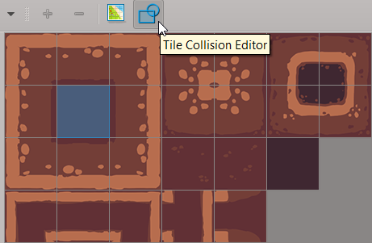
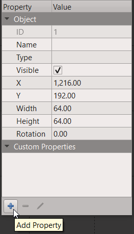
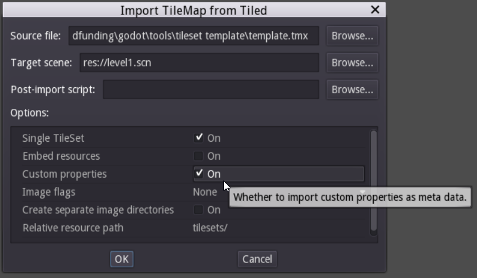

<!-- markdown-toc start - Don't edit this section. Run M-x markdown-toc-refresh-toc -->
**Table of Contents**

- [Modifying the imported level](#modifying-the-imported-level)
- [How to edit your tileset's collision shapes](#how-to-edit-your-tilesets-collision-shapes)
- [Object layers: supported types](#object-layers-supported-types)
- [Custom properties](#custom-properties)
    - [Add custom properties in Tiled](#add-custom-properties-in-tiled)
    - [Read the metadata in Godot](#read-the-metadata-in-godot)
    - [Post-import script: modify the imported scene](#post-import-script-modify-the-imported-scene)

<!-- markdown-toc end -->


# Modifying the imported level #

Do not modify the imported scene directly. Instead, instantiate it or create a new scene inherited from it.
If you do modify the source scene, all your changes will be lost next time you reimport.

# How to edit your tileset's collision shapes #

Starting with Tiled 1.0, tileset files are separate from maps. To edit the tileset's collisions, open it, click a tile to select it, and click on the "Tile Collision Editor" icon in the toolbar above the viewport.



Draw collision shapes in the newly opened tab. To snap to the grid, check the corresponding option in the View menu -> Snapping -> Snap to Grid.

Tip: you can copy and paste collision shapes between tiles. iIn the collision editor, press <kbd>S</kbd> to activate the "select object" tool, click the shape to select it, <kbd>Ctrl C</kbd> to copy and <kbd>Ctrl V</kbd> to paste it.

**Warning**: Godot only supports 1 collision shape per tile.


# Object layers: supported types #

Any shape you draw in Tiled is called an "object". The addon treats them as collision shapes by default, but it can also turn them into navigation paths or light occluders in Godot. To do that, select the shape, and in the properties editor, fill one of 2 keywords in the "Type" field:

1. `navigation`
1. `occluder`

Note this doesn't work with ellipses, as Godot doesn't support those shapes for navigation and light occluders. Also, if you use an object layer, you can't set its content as `navigation`.

# Custom properties #

You might want to add interactive elements built in Godot to your Tiled levels automatically: doors, lamps, chests, etc. You cannot do this directly from Tiled. However, the addon supports Tiled's object layers and custom properties. Using the Post-import script feature, you can add objects to your scene based on that. Note that Godot doesn't support metadata at the tile level, so it will only work with objects (_rectangles, polygons, etc._).

## Add custom properties in Tiled ##

Once you have an object layer, create an object using the tools in the toolbar above the viewport, and select it with the select tool (<kbd>S</kbd>). To add a custom property to it, head to the properties tab on the left, and find the blue "+" icon at the bottom.



Name it as you'd like (you'll need the name to retrieve the property in GDscript), and give it a value if needed. Select multiple objects before you set a property to modify all selected objects.

## Read the metadata in Godot ##

When you import the TMX file, make sure that the "custom properties" option is on. It is by default. If it's off, you will not get any metadata. If you already imported the TMX file, it will update automatically once you reopen the level's scene.



The metadata is imported using the `Object.set_meta()` method, and serialized in the scene. It is only accessible from the code, using:

```py
Object.get_meta_list() # returns an array of strings
Object.get_meta( String name ) # returns the custom property's value
Object.has_meta( String name ) # returns true if the metadata exists
```

For more information, check the [Object class](http://docs.godotengine.org/en/stable/classes/class_object.html) in the Godot reference.

## Post-import script: modify the imported scene

You can run any script with a post_import method. The plugin will pass it the imported scene, so you can append level elements built in Godot.

Add a Godot node to the level. Use it to load level elements that were designed in Godot:

```py
extends Node

var my_node = load("res://my_scene.tscn")
func post_import(scene):
  var new_node = my_node.instance()
  # Set the node's owner to the current scene so it can be added to it from the editor
  new_node.set_owner(scene)
  scene.add_child(new_child)
  return scene
```

The scene tree's structure is like:

```
root
  > MainSceneNode
    > TileLayer
    > ObjectLayer
      > Object1
      > Object2
```

To find the objects' metadata, we can either retrieve them by name, or traverse the node tree and go down 3 levels from the root.

You can use Tiled's custom properties stores as metadata to know which scene to import. Preload the nodes to instantiate, traverse the scene tree, read the imported node's metadata and add new nodes based on that. Here's a basic example to show the logic:

```py
# Traverse the node tree
var top_level_node = get_tree().get_root().get_child(0)

for node in top_level_node.get_children():
    # To know the type of a node, check if it is an instance of a base class
    # The addon imports tile layers as TileMap nodes and object layers as Node2D
    if node is TileMap:
        pass
    elif node is Node2D:
        for object in node.get_children():
            # Check if the node has a custom property named "type"
            if object.has_meta("type"):
                # If so, get the type value
                var type = object.get_meta("type")
                var node_to_clone = null
                if type == "door":
                    node_to_clone = Door
                elif type == "lamp":
                    node_to_clone = Lamp
                if node_to_clone:
                    var new_instance = node_to_clone.instance()
                    # The reference to the scene is given by the post_import method
                    node_to_clone.set_pos(object.get_pos())
                    new_instance.set_owner(scene)
                    # Add the node (Door or Lamp) and remove the object imported by the addon
                    node.add_child(node_to_clone)
                    object.queue_free()
```
